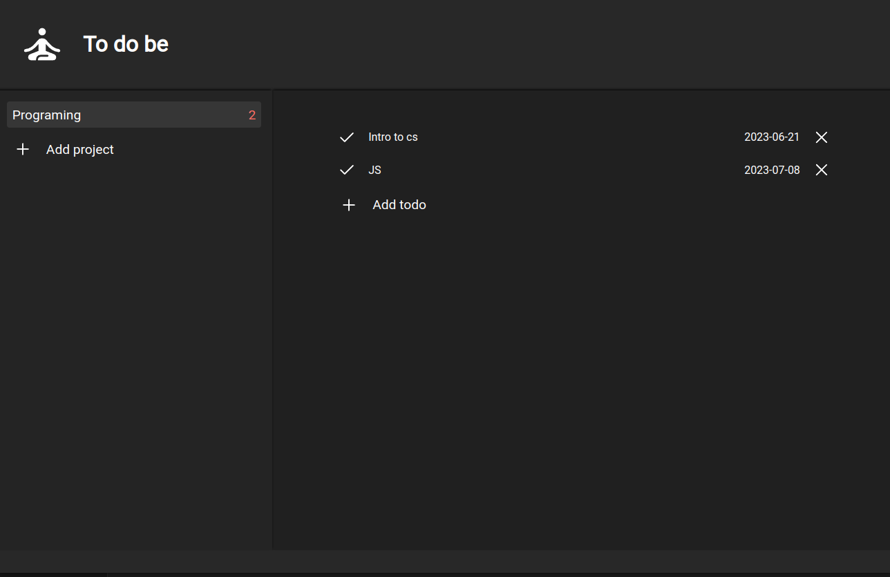

# To Do Be

# Odin Project - to do app challange

This is a solution to Odin Projects to do app challange.

## Table of contents

- [Overview](#overview)
  - [Screenshot](#screenshot)
  - [Links](#links)
- [What I've learned](#Learned)
- [Author](#author)

## Overview

This is a simple responsive to-do-app

### Screenshot

### Links

[Click to view live site](https://gwynbleidd0014.github.io/tic-tac-toe/)

## Learned

I've got more practice with js objects and dom manipulation.

## Author

Hello, I'm Ucha, you might know me as [gwynbleidd0014](https://github.com/gwynbleidd0014) on github
